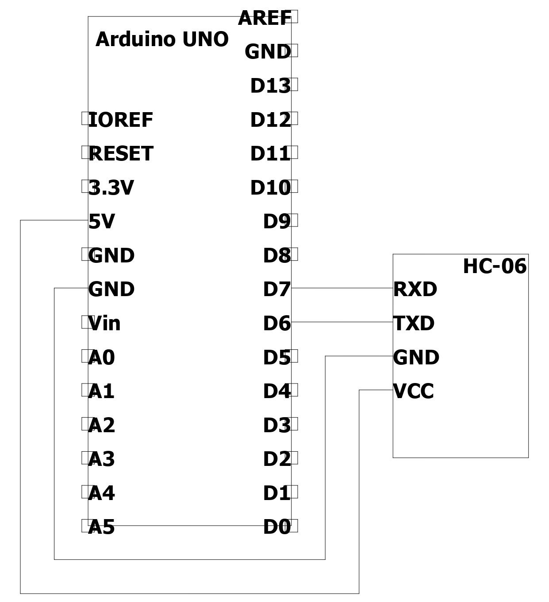
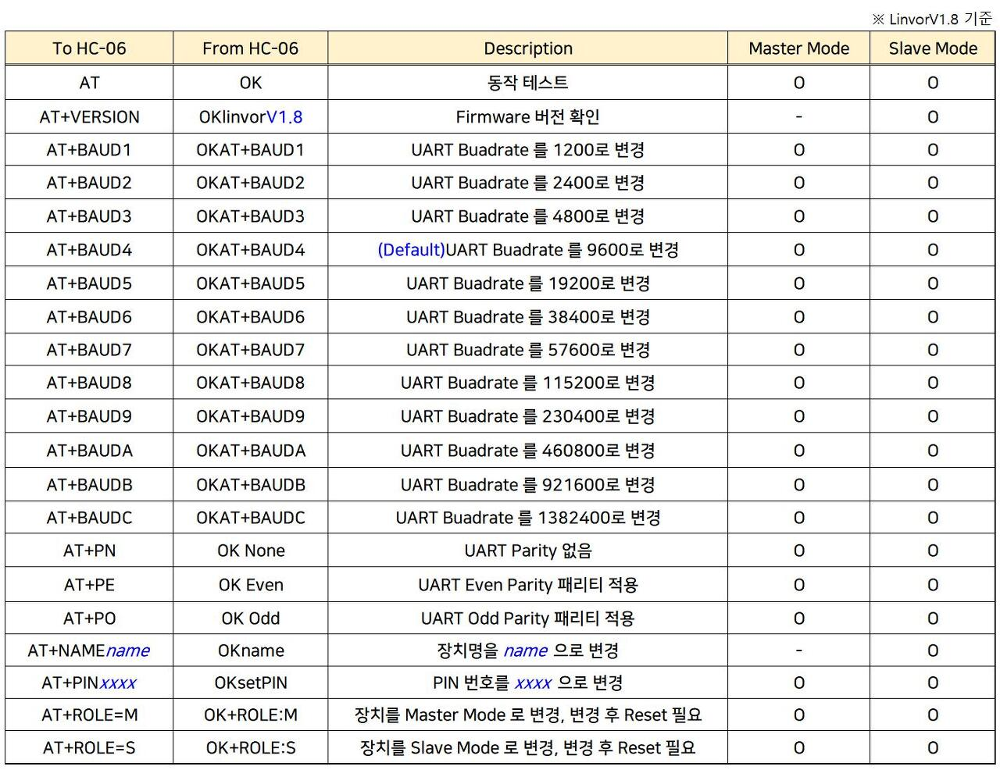
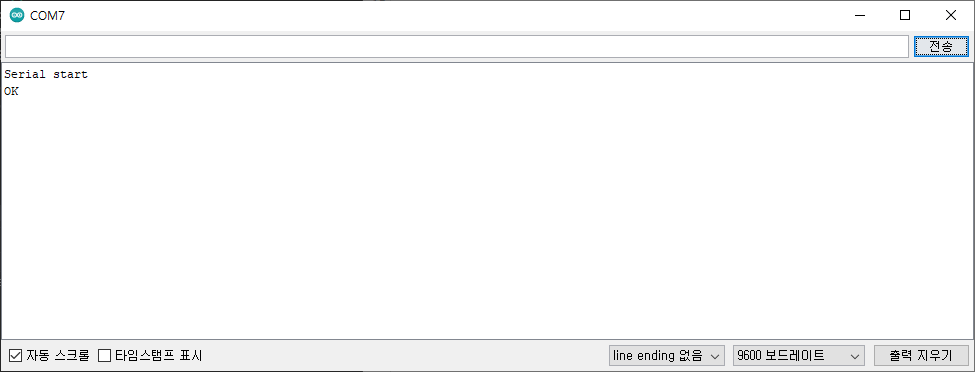
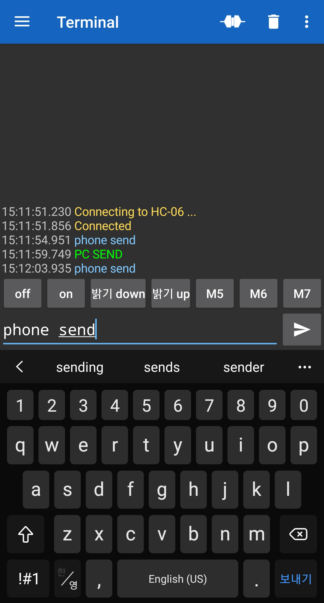
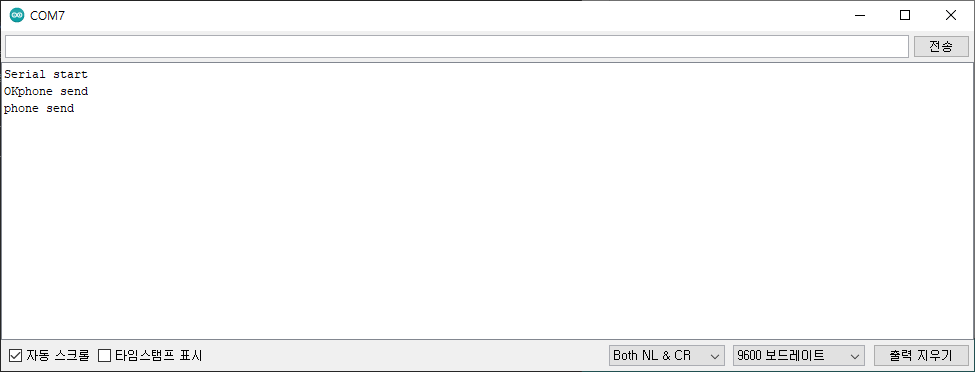

# HC-06 bluetooth module

## 사양
	- 작동 전압 : 3.3V ~ 5V
	- 블루투스 2.0
	- 기본 설정
		- name		: HC-06
		- baud rate : 9600
		- Pincode	: 1234 or 0000

## 필요 하드웨어
	- HC-06
	- Arduino UNO
	- UNO cable
	- F-M cable(4ea)

## 연결
	- TXD, RXD를 UNO보드의 Digital 중 원하는 핀으로 연결하여 사용합니다.(본문에서는 6, 7 사용)

|HC-06|Arduino UNO|
|--|--|
|RXD|D7(변경 가능)|
|TXD|D6(변경 가능)|
|GND|GND|
|VCC|5V|

## 라이브러리
	- SoftwareSerial

## AT command
	- AT 명령어를 사용하여 연결상태 확인이 가능합니다.
	- 시리얼 모니터에서 AT커맨드를 전송하여 사용 가능합니다.(사용 시 전송옵션을 변경해서 사용하며 필자는 line ending 없으로 사용)
	- HC-06 모듈이 타 기기에 연결될 경우 AT command가 작동하지 않습니다.

## example_code_1.cpp
	1.	소스코드 'code/example_code_1.cpp' 업로드
	2.	AT(대문자로 입력) 시리얼 모니터로 전송 후 OK응답 확인

	3.	스마트폰 'Serial Bluetooth Terminal'앱 설치
	4.	앱 접속 후 HC-06 연결
	5.	텍스트 전송하여 작동하는지 확인(본문에서는 AT이후 가독성이 좋도록 시리얼 모니터 전송옵션을 'Both NL & CR'로 변경하였습니다.)

